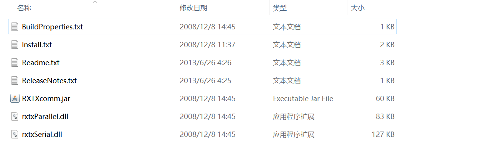

### 使用第三方库 RXTX 实现串口通信（RS-232 协议）

1. 访问 RXTX 官网：<http://fizzed.com/oss/rxtx-for-java>

2. 根据自己电脑系统下载相应文件

3. 以 Windows-x64 为例，下载解压后如下：

   

4. 中的 Install.txt 中官方给出了使用说明，Windows 系统如下：

   ```text
   Copy RXTXcomm.jar ---> <JAVA_HOME>\jre\lib\ext
   Copy rxtxSerial.dll ---> <JAVA_HOME>\jre\bin
   Copy rxtxParallel.dll ---> <JAVA_HOME>\jre\bin
   ```

5. 说明：

   1. 如果 RXTXcomm.jar 作为项目开发包如果已经导入到了项目中，则可以不必复制到`<JAVA_HOME>\jre\lib\ext`下

   2. rxtxSerial.dll、rxtxParallel.dll 文件必须放到`<JAVA_HOME>\jre\bin`下，如果是 Windows 系统，则也可以放到`C:\Windows\System32`目录下

   3. 如果是 Maven 应用，则可以 Maven 中央仓库获取 [RXTX 依赖](https://mvnrepository.com/artifact/org.bidib.jbidib.org.qbang.rxtx/rxtxcomm)：

      ```xml
      <!-- https://mvnrepository.com/artifact/org.bidib.jbidib.org.qbang.rxtx/rxtxcomm -->
      <dependency>
          <groupId>org.bidib.jbidib.org.qbang.rxtx</groupId>
          <artifactId>rxtxcomm</artifactId>
          <version>2.2</version>
      </dependency>
      ```

6. 使用：

   1. 打开串口
   2. 使用 java.io.OutputStream 发送数据，或 java.io.InputStream 读取数据
   3. 关闭串口


> 参考：[Java RXTX 实现串口通信](https://blog.csdn.net/wangmx1993328/article/details/88692848)