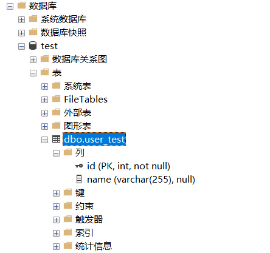
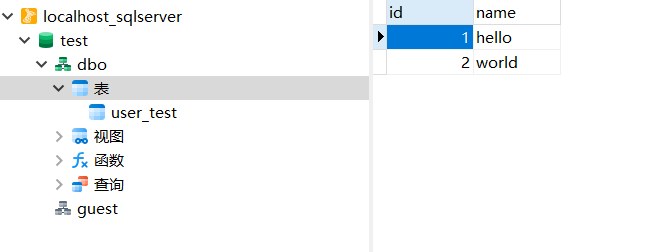

1. Mybatis 连接 SQL Server 示例
2. JDBC 连接 SQL Server 示例

主要参考 [Spring Boot 集成 MyBatis和 SQL Server实践](https://segmentfault.com/a/1190000017409489)

测试：

1. 创建数据库和表，在 application.properties 中配置用户名和密码
2. 运行项目
3. 访问 http://localhost:8080/getAllUser 获取数据